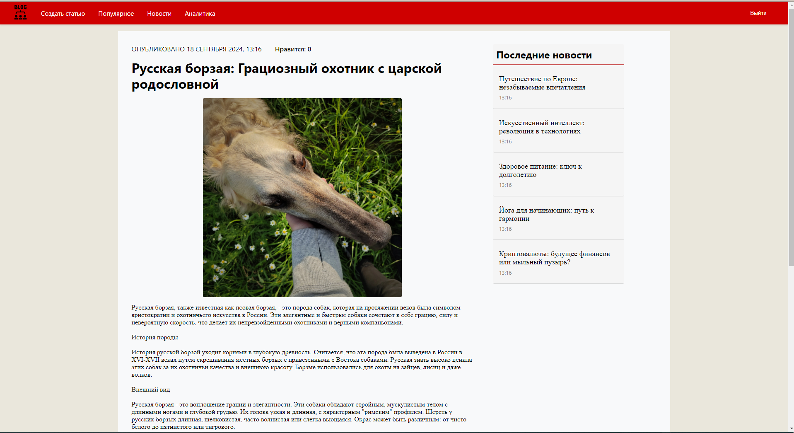
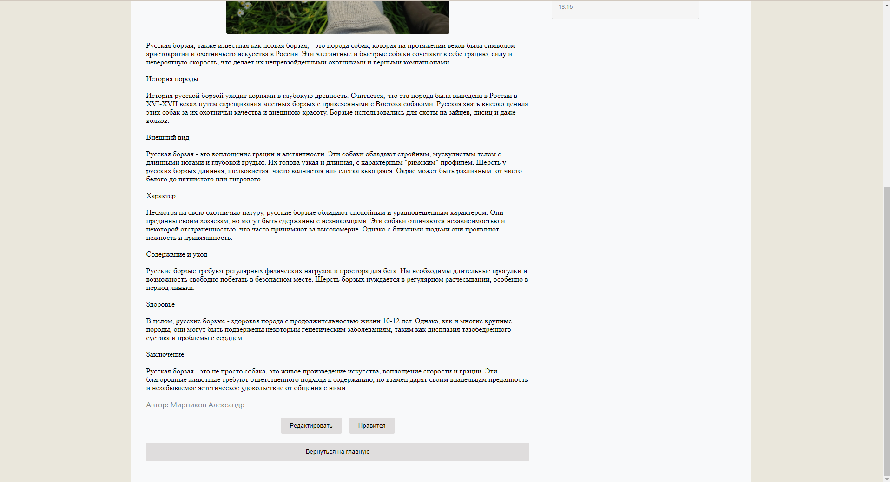
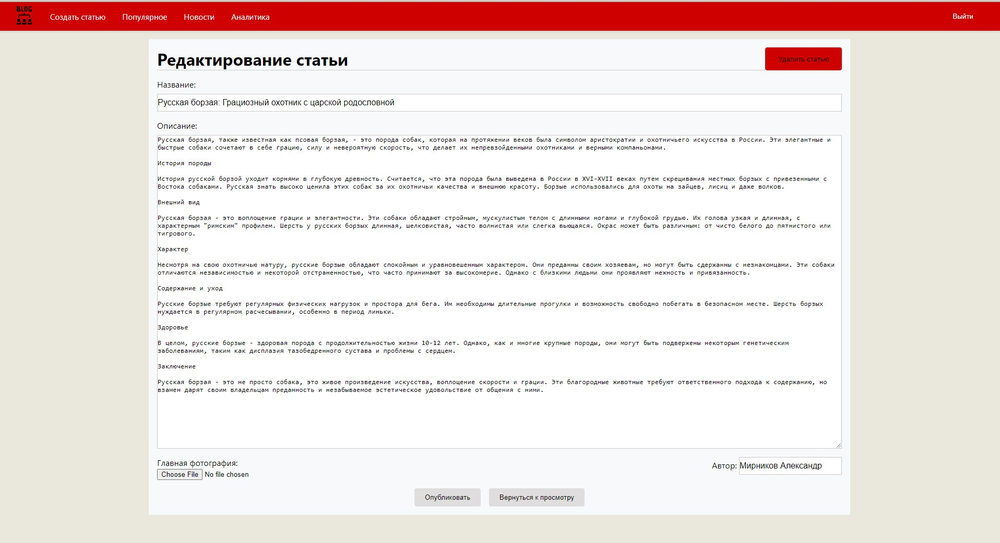
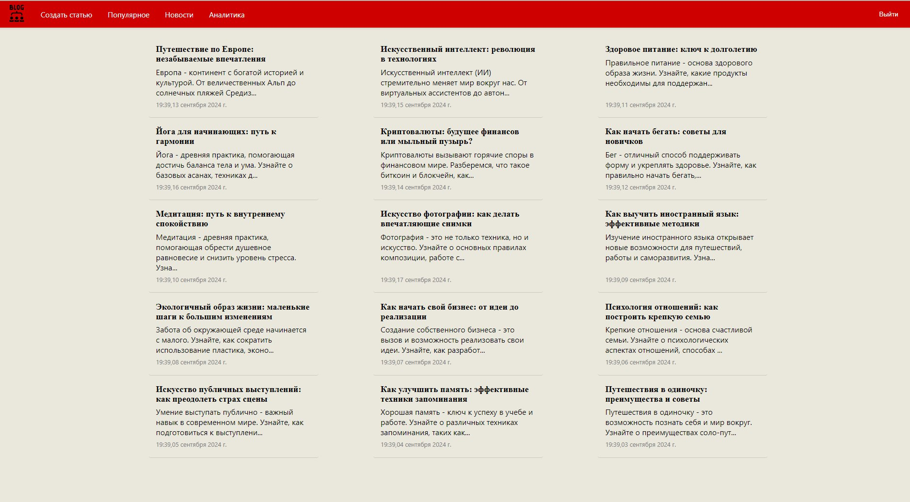

# Приложение Блог

Этот проект представляет собой простое приложение блога, созданное с использованием React, TypeScript и MobX. Оно позволяет пользователям читать статьи, ставить им лайки, а редакторам - создавать, редактировать и управлять статьями.

## Функциональность

- Аутентификация пользователей (имитация)
- Список статей
- Создание и редактирование статей
- Просмотр статей
- Функция "лайк"
- Прикрепление изображений к статьям

## Структура проекта

Проект использует React Router для навигации и MobX для управления состоянием. Основные компоненты:

- `LoginPage`: Обрабатывает аутентификацию пользователей
- `HomePage`: Отображает список статей
- `ArticlePage`: Показывает полное содержание статьи и позволяет ставить лайки
- `CreateEditArticlePage`: Обрабатывает создание и редактирование статей

## Маршруты

- /: Главная страница (список статей)
- /login: Страница входа
- /article/new: Создание новой статьи
- /article/edit/:id: Редактирование существующей статьи
- /article/:id: Просмотр статьи

## Управление состоянием

Приложение использует MobX для управления состоянием. Основной store - ArticleStore, который обрабатывает операции, связанные со статьями.

## Скриншоты

- Просмотр статьи:

- Редактирование статьи:

- Главная страница:

